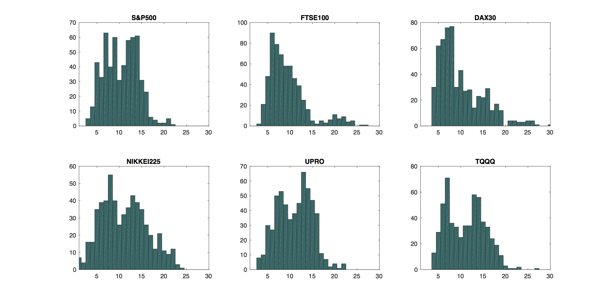

[](http://quantlet.de/)

## [](http://quantlet.de/) **TEDAS_dim_frequencies** [](http://quantlet.de/)

```yaml

Name of QuantLet : TEDAS_dim_frequencies

Published in : Tail Event Driven Asset Allocation

Description : 'estimates the model dimension by Lasso quantile regression in the TEDAS approach for
different market benchmarks: S&P 500, NIKKEI225, FTSE100, DAX30, UPRO, TQQQ'

Keywords : 'L1-norm penalty, Linear programming, VaR, dynamic, kurtosis, lasso, portfolio, quantile
regression, skewness, variable selection, histogram'

See also : TEDAS_perform, TEDAS_strategies2, TEDAS_strategies_dynamic, TEDAS_VaR_backtests

Output : A plot of estimated frequencies for the chosen benchmark indices

Author : Sergey Nasekin

Submitted : 2017/01/13

Datafile : 'tedas_daily_dataset_hfs_indiv.mat, highperfind.mat, BETA_dax30.mat, BETA_ftse100.mat,
BETA_nikkei225.mat, BETA_sp500.mat, BETA_tqqq.mat, BETA_upro.mat'

Example : 'S&P500 benchmark esitmated frequency, NIKKEI225 benchmark esitmated frequency, FTSE100
benchmark esitmated frequency, DAX30 benchmark esitmated frequency, UPRO benchmark esitmated
frequency, TQQQ benchmark esitmated frequency'

```




### MATLAB Code:
```matlab
clc
clear
close all

load tedas_daily_dataset_hfs_indiv
load BETA_tqqq 
load BETA_upro 
load BETA_sp500 
load BETA_nikkei225 
load BETA_ftse100 
load BETA_dax30
load highperfind

%% Extract indices and the funds' returns' matrix
XRET  = fundreturns;
[p,~] = size(BETA_dax30);

YRET_tqqq      = price2ret(highperfind.TQQQ(6:end));
YRET_upro      = price2ret(highperfind.UPRO);
YRET_sp500     = indretmat.SP500;
YRET_dax30     = indretmat.DAX30;
YRET_ftse100   = indretmat.FTSE100;
YRET_nikkei225 = indretmat.NIKKEI225;

%% Calculate the estimated dimension for 6 indices 
wwidth = 250;

indneg_upro      = zeros(1,length(YRET_upro)-wwidth);
indneg_tqqq      = zeros(1,length(YRET_tqqq)-wwidth);
indneg_sp500     = zeros(1,length(YRET_sp500)-wwidth);
indneg_dax30     = zeros(1,length(YRET_dax30)-wwidth);
indneg_ftse100   = zeros(1,length(YRET_ftse100)-wwidth);
indneg_nikkei225 = zeros(1,length(YRET_nikkei225)-wwidth);

for i = wwidth:size(YRET_upro,1)
    if YRET_upro(i) < 0
        indneg_upro(i-wwidth+1) = i;
    end
end

for i = wwidth:size(YRET_tqqq,1)
    if YRET_tqqq(i) < 0
        indneg_tqqq(i-wwidth+1) = i;
    end
end

for i = wwidth:size(YRET_sp500,1)
    if YRET_sp500(i) < 0
        indneg_sp500(i-wwidth+1) = i;
    end
end

for i = wwidth:size(YRET_dax30,1)
    if YRET_dax30(i) < 0
        indneg_dax30(i-wwidth+1) = i;
    end
end

for i = wwidth:size(YRET_ftse100,1)
    if YRET_ftse100(i) < 0
        indneg_ftse100(i-wwidth+1) = i;
    end
end

for i = wwidth:size(YRET_nikkei225,1)
    if YRET_nikkei225(i) < 0
        indneg_nikkei225(i-wwidth+1) = i;
    end
end

indneg_upro(indneg_upro==0)           = [];
indneg_tqqq(indneg_tqqq==0)           = [];
indneg_sp500(indneg_sp500==0)         = [];
indneg_dax30(indneg_dax30==0)         = [];
indneg_ftse100(indneg_ftse100==0)     = [];
indneg_nikkei225(indneg_nikkei225==0) = [];

indneg_upro      = indneg_upro - wwidth + 1;
indneg_upro      = indneg_upro(1:end-1);
indneg_tqqq      = indneg_tqqq - wwidth + 1;
indneg_tqqq      = indneg_tqqq(1:end-1);
indneg_sp500     = indneg_sp500 - wwidth + 1;
indneg_sp500     = indneg_sp500(1:end-1);
indneg_dax30     = indneg_dax30 - wwidth + 1;
indneg_dax30     = indneg_dax30(1:end-1);
indneg_ftse100   = indneg_ftse100 - wwidth + 1;
indneg_ftse100   = indneg_ftse100(1:end-1);
indneg_nikkei225 = indneg_nikkei225 - wwidth + 1;
indneg_nikkei225 = indneg_nikkei225(1:end-1);

% Extract non-zero betas
BETANEG_upro      = BETA_upro(:,indneg_upro);
BETANEG_tqqq      = BETA_tqqq(:,indneg_tqqq);
BETANEG_sp500     = BETA_sp500(:,indneg_sp500);
BETANEG_dax30     = BETA_dax30(:,indneg_dax30);
BETANEG_ftse100   = BETA_ftse100(:,indneg_ftse100);
BETANEG_nikkei225 = BETA_nikkei225(:,indneg_nikkei225);

% Calculate the estimated dimension histograms
qsize_upro = zeros(1,size(BETANEG_upro,2));
for i = 1:size(BETANEG_upro,2)
    qsize_upro(i) = sum(BETANEG_upro(:,i) < 0);
end

qsize_tqqq = zeros(1,size(BETANEG_tqqq,2));
for i = 1:size(BETANEG_tqqq,2)
    qsize_tqqq(i) = sum(BETANEG_tqqq(:,i) < 0);
end

qsize_sp500 = zeros(1,size(BETANEG_sp500,2));
for i = 1:size(BETANEG_sp500,2)
    qsize_sp500(i) = sum(BETANEG_sp500(:,i) < 0);
end

qsize_dax30 = zeros(1,size(BETANEG_dax30,2));
for i = 1:size(BETANEG_dax30,2)
    qsize_dax30(i) = sum(BETANEG_dax30(:,i) < 0);
end

qsize_ftse100 = zeros(1,size(BETANEG_ftse100,2));
for i = 1:size(BETANEG_ftse100,2)
    qsize_ftse100(i) = sum(BETANEG_ftse100(:,i) < 0);
end

qsize_nikkei225 = zeros(1,size(BETANEG_nikkei225,2));
for i = 1:size(BETANEG_nikkei225,2)
    qsize_nikkei225(i) = sum(BETANEG_nikkei225(:,i) < 0);
end


%% Plot the model size histograms
nbc = 30; %number of bins

qfig = figure; 
hold('on')

subplot(2,3,1)
hist(qsize_sp500,1:1:nbc)
h = findobj(gca,'Type','patch');
h.FaceColor = [0 0.4 0.4];
xlim([1,nbc])
title('S&P500')

subplot(2,3,2)
hist(qsize_ftse100,1:1:nbc)
h = findobj(gca,'Type','patch');
h.FaceColor = [0 0.4 0.4];
xlim([1,nbc])
title('FTSE100')

subplot(2,3,3)
hist(qsize_dax30,1:1:nbc)
h = findobj(gca,'Type','patch');
h.FaceColor = [0 0.4 0.4];
xlim([1,nbc])
title('DAX30')

subplot(2,3,4)
hist(qsize_nikkei225,1:1:nbc)
h = findobj(gca,'Type','patch');
h.FaceColor = [0 0.4 0.4];
xlim([1,nbc])
title('NIKKEI225')

subplot(2,3,5)
hist(qsize_upro,1:1:nbc)
h = findobj(gca,'Type','patch');
h.FaceColor = [0 0.4 0.4];
xlim([1,nbc])
title('UPRO')

subplot(2,3,6)
hist(qsize_tqqq,1:1:nbc)
h = findobj(gca,'Type','patch');
h.FaceColor = [0 0.4 0.4];
xlim([1,nbc])
title('TQQQ')

set(qfig, 'Position', [10 10 1000 500])
hold off

```
