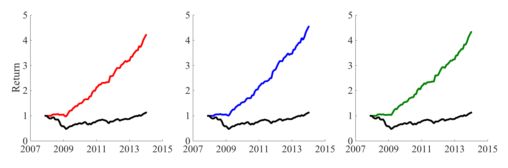
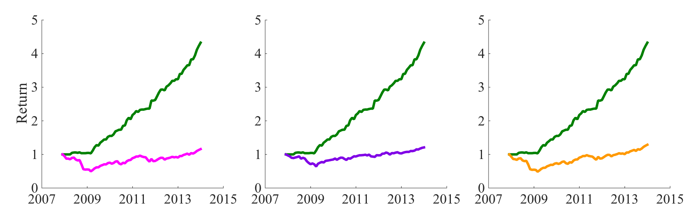

##  **<QNAME>**


```yaml
Name of QuantLet : TEDAS_gestalts

Published in : Tail Event Driven Asset Allocation

Description : 'Plots cumulative returns of 3 TEDAS_gestalts
for Mutual funds and German stocks samples against benchmark strategies:
Risk-parity, Mean-variance OGARCH and 60/40 portfolio, as well as corresponding
cores (DAX30 - for German stocks sample,  S&P500 - for Mutual Funds)'

Keywords :
- asset
- dax
- returns
- log-returns
- index
- plot
- strategy
- time-series  

See also : TEDAS_dcc_garch, TEDAS_ogarch, TEDAS_qrRho, TEDAS_strategies, TEDASstrategies2

Author : Alla Petukhina

Datafile : TEDAS_GS.mat, TEDAS_MF.mat, GS_ret.mat, MF_Ret.mat, GS_Tick.mat, MF_Tick.mat

Output : 'Plots with cumulative returns of TEDAS gestalts and benchmark
strategies for 2 samples (German stocks and Mutual funds)'

Example : 
- Plot with cumulative returns of TEDAS gestalts: TEDAS basic (red), TEDAS naive (blue) and 
TEDAS hybrid (green) for Mutual funds against the SnP500 (black)
- Plot with cumulative returns of TEDAS Hybrid (green) against benchmark strategies: MV OGARCH (magenta), 
60/40-portfolio (purple) and Risk Parity (orange) for Mutual funds

```






```Matlab
clc
clear
load('GS_Ret.mat') % Matrix of log-returns for German stocks' sample
load('GS_Tick.mat') 
load('MF_Ret.mat') % Matrix of log-returns for Mutual funds' sample
load('MF_Tick.mat') 
load('TEDAS_GS.mat') % Cumulative returns of TEDAS gestalts and benchmark srategies for German stocks' sample
load('TEDAS_MF.mat') % Cumulative returns for TEDAS gestalts and benchmark srategies for Mutual funds' sample

Datemf = TEDAS_MF(1:end, 1)

% Figure 1
set(figure,  'Position',  [100,  100,  1703,  548]);
% Subplot 1 TEDAS Basic and S&P500 buy-and-hold strategies
X1 = axes('ZGrid', 'on', 'XTickLabel', {'2007', '2009', '2011', '2013', '2015'}, ...
          'XTick', [733043 733774 734504 735235 735965], ...
          'FontSize', 34, ...
          'FontName', 'Times New Roman', ...
          'Position', [0.06 0.16 0.26 0.75]);
      
xlim(X1, [733043 735965]);
hold(X1, 'on');
ylabel('Return', 'FontSize', 37.4);
plot1 = plot(Datemf, TEDAS_MF(1:end, [2, 5]), 'LineWidth', 6);
set(plot1(1), 'Color', [1 0 0]);
set(plot1(2), 'Color', [0 0 0]);
% Subplot 2 TEDAS NAive and S&P500 buy-and-hold strategies
X2 = axes('ZGrid', 'on', ...
          'XTickLabel', {'2007', '2009', '2011', '2013', '2015'}, ...
          'XTick', [733043 733774 734504 735235 735965], ...
          'FontSize', 34, ...
          'FontName', 'Times New Roman', ...
          'Position', [0.38 0.16 0.26 0.75]);
xlim(X2, [733043 735965]);
hold(X2, 'on');
plot2 = plot(Datemf, TEDAS_MF(1:end, [3, 5]), 'LineWidth', 6);
set(plot2(1), 'Color', [0 0 1]);
set(plot2(2), 'Color', [0 0 0]);
% Subplot 3 TEDAS Hybrid and S&P500 buy-and-hold strategies
X3 = axes('ZGrid', 'on', ...
          'XTickLabel', {'2007', '2009', '2011', '2013', '2015'}, ...
          'XTick', [733043 733774 734504 735235 735965], ...
          'FontSize', 34, ...
          'FontName', 'Times New Roman', ...
          'Position', [0.7 0.16 0.26 0.75]);
xlim(X3, [733043 735965]);
hold(X3, 'on');
plot3 = plot(Datemf, TEDAS_MF(1:end, [4, 5]), 'LineWidth', 6);
set(plot3(1), 'Color', [0 0.5 0]);
set(plot3(2), 'Color', [0 0 0])

% Figure 2 
set(figure,  'Position',  [100,  100,  1703,  548]);
% Subplot 1 TEDAS Hybrid and Mean-Variance OGARCH strategies
X1 = axes('ZGrid', 'on', 'XTickLabel', {'2007', '2009', '2011', '2013', '2015'}, ...
          'XTick', [733043 733774 734504 735235 735965], ...
          'FontSize', 34, ...
          'FontName', 'Times New Roman', ...
          'Position', [0.06 0.16 0.26 0.75]);
      
xlim(X1, [733043 735965]);
hold(X1, 'on');
ylabel('Return', 'FontSize', 37.4);
plot1 = plot(Datemf, TEDAS_MF(1:end, [4, 6]), 'LineWidth', 6);
set(plot1(1), 'Color', [0 0.5 0]);
set(plot1(2), 'Color', [1 0 1]);
% Subplot 2 TEDAS Hybrid and 60/40-portfolio strategies
X2 = axes('ZGrid', 'on', ...
          'XTickLabel', {'2007', '2009', '2011', '2013', '2015'}, ...
          'XTick', [733043 733774 734504 735235 735965], ...
          'FontSize', 34, ...
          'FontName', 'Times New Roman', ...
          'Position', [0.38 0.16 0.26 0.75]);
xlim(X2, [733043 735965]);
hold(X2, 'on');
plot2 = plot(Datemf, TEDAS_MF(1:end, [4, 7]), 'LineWidth', 6);
set(plot2(1), 'Color', [0 0.5 0]);
set(plot2(2), 'Color', [0.5 0 0.9]);
% Subplot 3 TEDAS Hybrid and Risk-parity strategies
X3 = axes('ZGrid', 'on', ...
          'XTickLabel', {'2007', '2009', '2011', '2013', '2015'}, ...
          'XTick', [733043 733774 734504 735235 735965], ...
          'FontSize', 34, ...
          'FontName', 'Times New Roman', ...
          'Position', [0.7 0.16 0.26 0.75]);
xlim(X3, [733043 735965]);
hold(X3, 'on');
plot3 = plot(Datemf, TEDAS_MF(1:end, [4, 8]), 'LineWidth', 6);
set(plot3(1), 'Color', [0 0.5 0]);
set(plot3(2), 'Color', [1 0.6 0])
```
