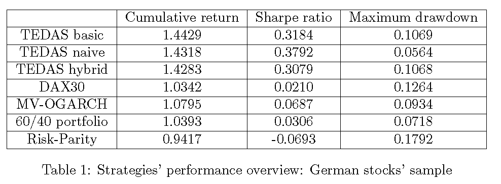

##  **TEDAS_perform**

```yaml
Name of QuantLet :  TEDAS_perform

Published in : Tail Event Driven Asset Allocation
  
Description : 'Constructs latex table with performance measures of 
of 3 TEDAS gestalts for Mutual funds and German stocks samples and benchmark 
strategies : Risk-parity, Mean-variance OGARCH and 60/40 portfolio, as well as 
corresponding cores (DAX30 - for German stocks sample,  S&P500 - for Mutual 
Funds). The following traditional performance and risk measures for allocation
strategies are presented : cumulative returns, Sharpe ratios, Maximum
drawdowns'

Keywords : asset, dax, returns, log-returns, index, strategy, time-series   

See also : 'TEDAS_dcc_garch, TEDAS_ogarch, TEDAS_qrRho, TEDAS_strategies,
TEDASstrategies2, TEDAS_gestalts' 

Author : Alla Petukhina

Submitted :  
  
Datafile : latexTable.m, TEDAS_GS.mat, TEDAS_MF.mat, TEDAS_RF_GS.mat, TEDAS_RF_MF.mat 

Output:  'LaTex code for the table, containing performance measures for
TEDAS gestalts and benchmark strategies'

Example:  Table containing performance measures for TEDAS gestalts and benchmark strategies
```





```Matlab
clc
clear
load('TEDAS_GS.mat') % Cumulative returns of TEDAS gestalts and benchmark srategies for German stocks' sample
load('TEDAS_MF.mat') % Cumulative returns for TEDAS gestalts and benchmark srategies for Mutual funds' sample
load('TEDAS_RF_GS.mat') % Risk-free rate for German stocks (Long Term German government Bond  9-10 years) 
load('TEDAS_RF_MF.mat') % Risk-free rate for Mutual funds 
ishift  = 0;
num_dig = 4;
Date    = TEDAS_GS(2:end,1);
RetGS   = price2ret(TEDAS_GS(1:end,2:end),[], 'Periodic');
RetMF   = price2ret(TEDAS_MF(1:end,2:end),[], 'Periodic');

%% Performance measures calculation
% Cumulative returns' vector for 3 TEDAS gestalts and 5 benchmark-strategies
Cumret = TEDAS_GS(end,2:end)';
Cumret = round(Cumret*(10^num_dig))./(10^num_dig);

% Sharpe ratio for 3 TEDAS gestalts and 5 benchmark-strategies

for i = 1:size(RetGS,2)
    sharper(i) = sharpe(RetGS(1:end,i),TEDAS_RF_GS(1:end,end))
    sharpelast = sharper(i);
    ishift     = ishift + 1
end
SHARPE = [sharper,sharpelast]';
SHARPE = round(SHARPE(1:end-1,1)*(10^num_dig))./(10^num_dig);

% Maximum Drawdown for 3 TEDAS gestalts and 5 benchmark-strategies

for i = 2:size(TEDAS_GS,2)
    maxdd(i-1) = maxdrawdown(TEDAS_GS(1:end,i))
    maxddlast = maxdd(i-1);
    ishift     = ishift + 1
end
MAXDD  = [maxdd,maxddlast]';
MAXDD  = round(MAXDD(1:end-1,1)*(10^num_dig))./(10^num_dig);


%% Building latex table with TEDAS gestalts' and benchmarks' performance measures

input.data                      = [Cumret, SHARPE, MAXDD];

input.tableColLabels            = {'Cumulative return','Sharpe ratio','Maximum drawdown'};
input.tableRowLabels            = {'TEDAS basic','TEDAS naive','TEDAS hybrid'...
                                   'DAX30','MV-OGARCH','60/40 portfolio','Risk-Parity'};
input.transposeTable            = 0;
input.dataFormatMode            = 'column'; 
input.dataNanString             = '-';
input.tableColumnAlignment      = 'c';
input.tableBorders              = 1;
input.tableCaption              = 'Strategies performance overview: German stocks sample';
input.tableLabel                = 'MyTableLabel';
input.makeCompleteLatexDocument = 1;
latex                           = latexTable(input);
