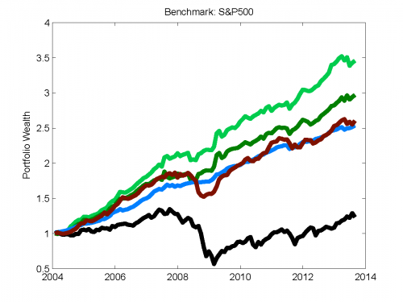
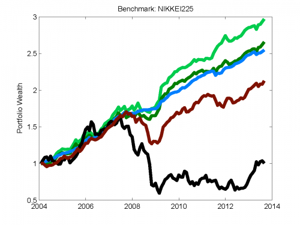
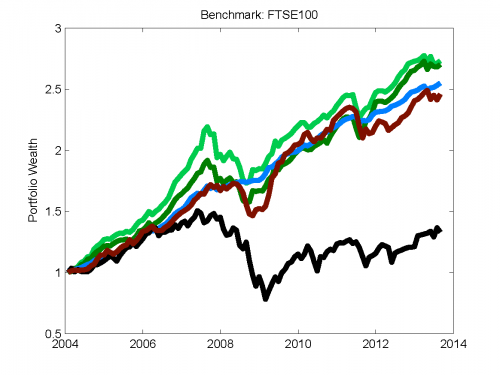
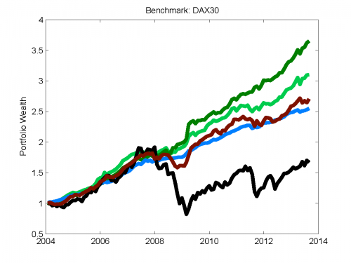

##  **<QNAME>**


```yaml
Name of QuantLet : TEDASstrategies2

Published in : Tail Event Driven Asset Allocation

Description : 'Testimates the cumulative return for 4 strategies from the latest 
update of the TEDAS project: TEDAS Advanced, TEDAS Expert, TEDAS Naive and RR' 

Keywords : 'L1-norm penalty, Linear programming, VaR, dynamic, kurtosis, lasso, 
portfolio, quantile regression, skewness, variable selection' 

See also : TEDAS_gestalts, TEDAS_perform

Output : 'A plot of the three strategies cumulative return against the chosen 
benchmark index'

Author : Sergey Nasekin

Datafile : 'hedf_bloom_ret.mat, hedf_bloom_tick.mat, icatvd.p, icatvd_init.p, 
stock_indices.mat'

Example : 
- S&P500 benchmark cumulative returns
- NIKKEI225 benchmark cumulative returns
- FTSE100 benchmark cumulative return
- DAX30 benchmark cumulative return
```







```Matlab
% clear memory and close windows

clear all
close all
clc

load('hf_bloom_ret.mat') %loading data
load('hf_bloom_tick.mat') 
load('indices_ret.mat') 

Date      = HFBloomRet(1:end,1);
Date      = [Date;datenum('31-Jan-2013')];
XRET      = HFBloomRet(1:end,2:end-1); %creating covariate and response matrices

%select the benchmark: %"1" for S&P500, "2" for FTSE100, "3" for DAX30, "5" for NIKKEI225
YRET      = indices_ret(:,2);

IND       = YRET;
FUNDS     = XRET;

lambda    = linspace(0.01,5,100); %grid of lambdas
wwidth    = 50; %moving window width
wshift    = 0;

cl        = 0.99; 
z         = norminv(cl,0,1); %standard normal quantile for Cornish-Fisher expansion
factor_a  = (1/(1 - cl))*normpdf(z); 
num_digw  = 3;
TargRet   = 0.8; %target return quantile level
varthresh = 0.95;
eta       = 10;
%choose the nonlinearity for the ICA method
method    = 'pow3';

% pre-allocating for the arrays to be created
clear cap capp cappp
cap{wwidth}   = 1; 
capp(wwidth)  = 1;
ucap{wwidth}  = 1; 
ucapp(wwidth) = 1;
ncap{wwidth}  = 1; 
ncapp(wwidth) = 1;

capit(wwidth) = 1;
OGCAPIT       = [];
WGT           = {};
UWTS          = {};
WTS           = {};
COVMOG        = {};
PCovOG        = [];

cappp         = [];
ucappp        = [];
ncappp        = [];
BETA          = [];
numlam        = [];
ll            = [];
lll           = [];
flag          = [];
VaRQ          = [];
EXPU          = [];
COVM          = {};
SKM           = {};
KURTM         = {};
INDEX         = {};
ESTP          = {};
SKKURT        = {};
Specs         = garchset('Distribution', 'Gaussian', 'Display', 'off', 'VarianceModel', 'GARCH', 'P', 1, 'Q', 1,...
    'R', 1, 'M', 1);

options       = optimoptions('fmincon','Algorithm','interior-point','TolFun',1e-6,'MaxFunEvals',100000,'MaxIter',10000);

%%
%TEDAS Advanced, TEDAS Expert, TEDAS Naive and RR strategies
for l = wwidth:size(FUNDS,1)-1
    
    X     = XRET(1+wshift:l,:);
    Y     = YRET(1+wshift:l,:);
    
    if IND(l) < 0
        tau_i   = ksdensity(Y,IND(l),'function','cdf');
        tau_i   = round(tau_i.*(10^2))./(10^2);
        
        [n,k]   = size(X);
        %%%%%%%%%%%%%%%%%%%%%%%%%%%%%%%%%%%%%%%%%%%%%%%%%%%%%%%%%%%%%%%  
        coeff   = L1QR(Y, X, tau_i); 
        BetaAll = round(coeff.*(10^num_digw))./(10^num_digw);
        clear XWW
        XWW     = zeros(n,k);
        for j = 1:n
            XWi      = X(j,:).*max(abs(BetaAll'),1/sqrt(n));
            XWW(j,:) = XWi;
        end

        BetaLam = round(BetaAll.*(10^num_digw))./(10^num_digw);
        %rule-of-thumb lambda (see the text) 
        Lambda  = 0.25*sqrt(sum(abs(BetaLam) > 0))*log(k)*(log(n))^(0.1/2);
        Coeff   = L1QR(Y, XWW, tau_i, Lambda);

        %calculating the final Adaptive Lasso coefficients
        COEFF   = Coeff.*max(abs(BetaLam),1/sqrt(n));
        BETAFIN = round(COEFF.*(10^num_digw))./(10^num_digw);
        %%%%%%%%%%%%%%%%%%%%%%%%%%%%%%%%%%%%%%%%%%%%%%%%%%%%%%%%%%%%%%

        ind     = find(BETAFIN(:,1) < 0);
        RetMat  = FUNDS(1:l,ind);
        [nn,kk] = size(RetMat);
        w0      = ones(1,size(RetMat,2))./size(RetMat,2);
        MeanRet = mean(RetMat)';
        %Cmat   = eye(nn) - (1/nn)*ones(nn,1)*ones(1,nn);
        P       = RetMat;

        if size(P,2) > 1
            count     = 0;
            err_count = 0;
            while count == err_count
                try 
                [~,F,A,~,estp,SigMat] = icatvd_init(P,method);
                catch err    
                    if strcmpi(method,'pow3') == 1
                        method = 'tanh';
                    elseif strcmpi(method,'tanh') == 1 
                        method = 'gauss';
                    elseif strcmpi(method,'gauss') == 1
                        method = 'skew';
                    elseif strcmpi(method,'skew') == 1
                        method = 'pow3';
                    end
                    err_count = err_count + 1;
                end
                count = count + 1;
            end
            [~,M2,M3,M4,skkurt,EstP]    = icatvd(P,estp,SigMat,F,A,'forecast'); 
            [Ht,numfactors]             = ogarch(P,1,1,1,1,varthresh);
        elseif size(P,2) == 1                   
            [Parameters, ~, ~, ~, ~, ~] = garchfit(Specs,P);
            [HForec,~]                  = garchpred(Parameters,P,1);
            M2                          = HForec^2;
            M3                          = skewness(P);
            M4                          = kurtosis(P);
        else
            cap{l}   = sum(cell2mat(cap(l)));
            VaR      = VaRQ(end);
            cap{l+1} = cap{l};
            capp     = cap{l+1};
            cappp    = [cappp,capp] 
            VaRQ     = [VaRQ,VaR]; 
            wshift   = wshift + 1; 
            ll       = [ll,l];
            continue                     
        end
        CovMat    = M2;
        wub       = ones(length(w0),1);
        wlb       = zeros(length(w0),1);
        Aeq       = ones(1,length(w0));
        beq       = 1;
        AA        = -MeanRet';
        bb        = -quantile(MeanRet,TargRet);
        cap{l}    = sum(cell2mat(cap(l)));
        ucap{l}   = sum(cell2mat(ucap(l)));

        %(1): CF-CVaR OPTIMIZATION: TEDAS Advanced
        [wts,VaR]  = fmincon(@(w) -w*MeanRet + (1 + (z*((1/((w*M2*w')^(3/2)))*((w*M3*kron(w',w'))/6))) + ((( (1/((w*M2*w')^2))*...
            (w*M4*kron(kron(w',w'),w')) - 3)/24))*(z^2 - 1) - ((((1/((w*M2*w')^(3/2)))*...
            (((w*M3*kron(w',w')))))^2)/36)*(2*z^2 - 1) )*(sqrt(w*M2*w'))*factor_a,...
            w0,AA,bb,Aeq,beq,wlb,wub,[],options);
        wts        = round(wts.*(10^num_digw))./(10^num_digw);

        %(2): MARKOWITZ OPTIMIZATION: RR
        [wgt,PCov] = fmincon(@(w)((sqrt(w*Ht*w'))),w0,AA,bb,Aeq,beq,wlb,wub,[],options);
        wgt        = round(wgt.*(10^num_digw))./(10^num_digw);
        
        %(3): UTILITY OPTIMIZATION: TEDAS Expert
        [uwts,EU]  = fmincon(@(w) exp(-eta*(w*MeanRet))*(1 + (eta^2/2)*(w*M2*w') - (eta^3/factorial(3))*...
                    (w*M3*kron(w',w')) + (eta^4/factorial(4))*(w*M4*kron(kron(w',w'),w')) ),...
                    w0,AA,bb,Aeq,beq,wlb,wub,[],options);
        uwts       = round(uwts.*(10^num_digw))./(10^num_digw);
        
        %check the CVaR output 
        if abs(VaR*cap{l}) > cap{l}
            [n,k]    = size(X);
            CoefTemp = zeros(k,length(lambda));
            SIC      = zeros(1,length(lambda));
            for i = 1:length(lambda)
                beta          = L1QR(Y, X, tau_i, lambda(i));
                beta          = round(beta.*(10^num_digw))./(10^num_digw);
                SIC(i)        = n*log(n^(-1)*(sum(qrRho(Y - X*beta,tau_i)))) + log(n)*(length(beta(beta ~= 0)));
                CoefTemp(:,i) = beta;
            end
            bicmin  = find(SIC == min(SIC));
            if length(bicmin) > 1
                bicmin = bicmin(end);
            end
            BetaAll = CoefTemp(:,bicmin); 
            clear XWW
            XWW = zeros(n,k);
            for j = 1:n
                XWi = X(j,:).*max(abs(BetaAll'),1/sqrt(n));
                XWW(j,:)  = XWi;
            end
            BetaLam = round(BetaAll.*(10^num_digw))./(10^num_digw);
            %rule-of-thumb lambda (see the text) 
            Lambda  = 0.25*sqrt(sum(abs(BetaLam) > 0))*log(k)*(log(n))^(0.1/2);
            Coeff   = L1QR(Y, XWW, tau_i, Lambda);
            %calculating the final Adaptive Lasso coefficients
            COEFF   = Coeff.*max(abs(BetaLam),1/sqrt(n));
            BETAFIN = round(COEFF.*(10^num_digw))./(10^num_digw);

            ind     = find(BETAFIN(:,1) < 0);
            if length(ind) > 10
                ind = ind(1:10);
            end                   
            RetMat  = FUNDS(1:l,ind);
            [nn,kk] = size(RetMat);
            w0      = ones(1,size(RetMat,2))./size(RetMat,2);
            MeanRet = mean(RetMat)';
            %Cmat    = eye(nn) - (1/nn)*ones(nn,1)*ones(1,nn);
            P       = RetMat;
            if size(P,2) > 1
            count     = 0;
            err_count = 0;
            while count == err_count
                try 
                [~,F,A,~,estp,SigMat] = icatvd_init(P,method);
                catch err    
                    if strcmpi(method,'pow3') == 1
                        method = 'tanh';
                    elseif strcmpi(method,'tanh') == 1 
                        method = 'gauss';
                    elseif strcmpi(method,'gauss') == 1
                        method = 'skew';
                    elseif strcmpi(method,'skew') == 1
                        method = 'pow3';
                    end
                    err_count = err_count + 1;
                end
                count = count + 1;
            end
                [~,M2,M3,M4,skkurt,EstP]    = icatvd(P,estp,SigMat,F,A,'forecast');
                [Ht,numfactors]             = ogarch(P,1,1,1,1,varthresh);
            elseif size(P,2) == 1                   
                [Parameters, ~, ~, ~, ~, ~] = garchfit(Specs,P);
                [HForec,~]                  = garchpred(Parameters,P,1);
                M2                          = HForec^2;
                M3                          = skewness(P);
                M4                          = kurtosis(P);
            else
                cap{l}   = sum(cell2mat(cap(l)));
                VaR      = VaRQ(end);
                cap{l+1} = cap{l};
                capp     = cap{l+1};
                cappp    = [cappp,capp] 
                VaRQ     = [VaRQ,VaR]; 
                wshift   = wshift + 1; 
                ll       = [ll,l];
            continue                     
            end
            CovMat     = M2;
            wub        = ones(length(w0),1);
            wlb        = zeros(length(w0),1);
            Aeq        = ones(1,length(w0));
            beq        = 1;
            AA         = -MeanRet';
            bb         = -quantile(MeanRet,TargRet);
            cap{l}     = sum(cell2mat(cap(l)));

            [wts,VaR]  = fmincon(@(w) -w*MeanRet + (1 + (z*((1/((w*M2*w')^(3/2)))*((w*M3*kron(w',w'))/6))) + ((( (1/((w*M2*w')^2))*...
                (w*M4*kron(kron(w',w'),w')) - 3)/24))*(z^2 - 1) - ((((1/((w*M2*w')^(3/2)))*...
                (((w*M3*kron(w',w')))))^2)/36)*(2*z^2 - 1) )*(sqrt(w*M2*w'))*factor_a,...
                w0,AA,bb,Aeq,beq,wlb,wub,[],options);
            wts        = round(wts.*(10^num_digw))./(10^num_digw);
            
            [wgt,PCov] = fmincon(@(w)((sqrt(w*Ht*w'))),w0,AA,bb,Aeq,beq,wlb,wub,[],options);
            wgt        = round(wgt.*(10^num_digw))./(10^num_digw);

            [uwts,EU]  = fmincon(@(w) exp(-eta*(w*MeanRet))*(1 + (eta^2/2)*(w*M2*w') - (eta^3/factorial(3))*...
                        (w*M3*kron(w',w')) + (eta^4/factorial(4))*(w*M4*kron(kron(w',w'),w')) ),...
                        w0,AA,bb,Aeq,beq,wlb,wub,[],options);
            uwts       = round(uwts.*(10^num_digw))./(10^num_digw);

        end

        %portfolio value appreciation
        cap{l+1}   = sum(cell2mat(cap(l)).*(1 + wts*FUNDS(l+1,ind)'));
        capp       = cap{l+1};    
        cappp      = [cappp,capp]
        capit(l+1) = sum(capit(l).*((1 + wgt*FUNDS(l+1,ind)')));
        caplast    = capit(end)
        OGCAPIT    = [OGCAPIT,caplast];
        ucap{l+1}  = sum(cell2mat(ucap(l)).*(1 + uwts*FUNDS(l+1,ind)'));
        ucapp      = ucap{l+1};    
        ucappp     = [ucappp,ucapp]
        %equal weights: TEDAS Naive
        ncap{l}    = (repmat(sum(cell2mat(ncap(l)))/(length(ind)),1,length(ind)));
        ncap{l+1}  = sum( cell2mat(ncap(l)).*(1 + FUNDS(l+1,ind)) );
        ncapp      = ncap{l+1};    
        ncappp     = [ncappp,ncapp];
                 
    else

        tau_i   = 0.7;        
        [n,k]   = size(X);      
        coeff   = L1QR(Y, X, tau_i); 
        BetaAll = round(coeff.*(10^num_digw))./(10^num_digw);
        clear XWW
        XWW     = zeros(n,k);
        for j = 1:n
            XWi = X(j,:).*max(abs(BetaAll'),1/sqrt(n));
            XWW(j,:)  = XWi;
        end

        BetaLam = round(BetaAll.*(10^num_digw))./(10^num_digw);
        %rule-of-thumb lambda (see the text) 
        Lambda  = 0.25*sqrt(sum(abs(BetaLam) > 0))*log(k)*(log(n))^(0.1/2)
        Coeff   = L1QR(Y, XWW, tau_i, Lambda);

        %calculating the final Adaptive Lasso coefficients
        COEFF   = Coeff.*max(abs(BetaLam),1/sqrt(n));
        BETAFIN = round(COEFF.*(10^num_digw))./(10^num_digw);
        %%%%%%%%%%%%%%%%%%%%%%%%%%%%%%%%%%%%%%%%%%%%%%%%%%%%%%%%%%%%%%

        ind     = find(BETAFIN(:,1) > 0);
        RetMat  = FUNDS(1:l,ind);
        [nn,kk] = size(RetMat);
        w0      = ones(1,size(RetMat,2))./size(RetMat,2);
        MeanRet = mean(RetMat)';
        %Cmat    = eye(nn) - (1/nn)*ones(nn,1)*ones(1,nn);
        P       = RetMat;

        if size(P,2) > 1
            count     = 0;
            err_count = 0;
            while count == err_count
                try 
                [~,F,A,~,estp,SigMat] = icatvd_init(P,method);
                catch err    
                    if strcmpi(method,'pow3') == 1
                        method = 'tanh';
                    elseif strcmpi(method,'tanh') == 1 
                        method = 'gauss';
                    elseif strcmpi(method,'gauss') == 1
                        method = 'skew';
                    elseif strcmpi(method,'skew') == 1
                        method = 'pow3';
                    end
                    err_count = err_count + 1;
                end
                count = count + 1;
            end         
            [~,M2,M3,M4,skkurt,EstP]    = icatvd(P,estp,SigMat,F,A,'forecast');
            [Ht,numfactors]             = ogarch(P,1,1,1,1,varthresh);
        elseif size(P,2) == 1                   
            [Parameters, ~, ~, ~, ~, ~] = garchfit(Specs,P);
            [HForec,~]                  = garchpred(Parameters,P,1);
            M2                          = HForec^2;
            M3                          = skewness(P);
            M4                          = kurtosis(P);
        else
            cap{l}   = sum(cell2mat(cap(l)));
            VaR      = VaRQ(end);
            cap{l+1} = cap{l};
            capp     = cap{l+1};
            cappp    = [cappp,capp] 
            VaRQ     = [VaRQ,VaR] 
            wshift   = wshift + 1 
            ll       = [ll,l]
            continue                     
        end
        CovMat = M2;
        wub    = ones(length(w0),1);
        wlb    = zeros(length(w0),1);
        Aeq    = ones(1,length(w0));
        beq    = 1;
        AA     = -MeanRet';
        bb     = -quantile(MeanRet,TargRet);
        cap{l} = sum(cell2mat(cap(l)));

        %(1): CF-CVaR OPTIMIZATION: TEDAS Advanced
        [wts,VaR]  = fmincon(@(w) -w*MeanRet + (1 + (z*((1/((w*M2*w')^(3/2)))*((w*M3*kron(w',w'))/6))) + ((( (1/((w*M2*w')^2))*...
            (w*M4*kron(kron(w',w'),w')) - 3)/24))*(z^2 - 1) - ((((1/((w*M2*w')^(3/2)))*...
            (((w*M3*kron(w',w')))))^2)/36)*(2*z^2 - 1) )*(sqrt(w*M2*w'))*factor_a,...
            w0,AA,bb,Aeq,beq,wlb,wub,[],options);
        wts        = round(wts.*(10^num_digw))./(10^num_digw);
        
        %(2): MARKOWITZ OPTIMIZATION: RR
        [wgt,PCov] = fmincon(@(w)((sqrt(w*Ht*w'))),w0,AA,bb,Aeq,beq,wlb,wub,[],options);
        wgt        = round(wgt.*(10^num_digw))./(10^num_digw);
        
        %(3): UTILITY OPTIMIZATION: TEDAS Expert
        [uwts,EU]  = fmincon(@(w) exp(-eta*(w*MeanRet))*(1 + (eta^2/2)*(w*M2*w') - (eta^3/factorial(3))*...
                    (w*M3*kron(w',w')) + (eta^4/factorial(4))*(w*M4*kron(kron(w',w'),w')) ),...
                    w0,AA,bb,Aeq,beq,wlb,wub,[],options);
        uwts       = round(uwts.*(10^num_digw))./(10^num_digw);
            
        if abs(VaR*cap{l}) > cap{l}
            [n,k]    = size(X);
            CoefTemp = zeros(k,length(lambda));
            SIC      = zeros(1,length(lambda));
            for i = 1:length(lambda)
                beta          = L1QR(Y, X, tau_i, lambda(i));
                beta          = round(beta.*(10^num_digw))./(10^num_digw);
                SIC(i)        = n*log(n^(-1)*(sum(qrRho(Y - X*beta,tau_i)))) + log(n)*(length(beta(beta ~= 0)));
                CoefTemp(:,i) = beta;
            end
            bicmin  = find(SIC == min(SIC));
            if length(bicmin) > 1
                bicmin = bicmin(end);
            end
            BetaAll = CoefTemp(:,bicmin); 
            clear XWW
            XWW = zeros(n,k);
            for j = 1:n
                XWi = X(j,:).*max(abs(BetaAll'),1/sqrt(n));
                XWW(j,:)  = XWi;
            end
            BetaLam = round(BetaAll.*(10^num_digw))./(10^num_digw);
            %rule-of-thumb lambda (see the text) 
            Lambda  = 0.25*sqrt(sum(abs(BetaLam) > 0))*log(k)*(log(n))^(0.1/2);
            Coeff   = L1QR(Y, XWW, tau_i, Lambda);
            %calculating the final Adaptive Lasso coefficients
            COEFF   = Coeff.*max(abs(BetaLam),1/sqrt(n));
            BETAFIN = round(COEFF.*(10^num_digw))./(10^num_digw);

            ind     = find(BETAFIN(:,1) > 0);
            RetMat  = FUNDS(1:l,ind);
            [nn,kk] = size(RetMat);
            w0      = ones(1,size(RetMat,2))./size(RetMat,2);
            MeanRet = mean(RetMat)';
            %Cmat    = eye(nn) - (1/nn)*ones(nn,1)*ones(1,nn);
            P       = RetMat;

            %estimating the icatvd model to estimate the time-changing
            %distribution structure
            if size(P,2) > 1
            count     = 0;
            err_count = 0;
            while count == err_count
                try 
                [~,F,A,~,estp,SigMat] = icatvd_init(P,method);
                catch err    
                    if strcmpi(method,'pow3') == 1
                        method = 'tanh';
                    elseif strcmpi(method,'tanh') == 1 
                        method = 'gauss';
                    elseif strcmpi(method,'gauss') == 1
                        method = 'skew';
                    elseif strcmpi(method,'skew') == 1
                        method = 'pow3';
                    end
                    err_count = err_count + 1;
                end
                count = count + 1;
            end
                [~,M2,M3,M4,skkurt,EstP]    = icatvd(P,estp,SigMat,F,A,'forecast');  
                [Ht,numfactors]             = ogarch(P,1,1,1,1,varthresh);
            elseif size(P,2) == 1                   
                [Parameters, ~, ~, ~, ~, ~] = garchfit(Specs,P);
                [HForec,~]                  = garchpred(Parameters,P,1);
                M2                          = HForec^2;
                M3                          = skewness(P);
                M4                          = kurtosis(P);
            else
                cap{l}   = sum(cell2mat(cap(l)));
                VaR      = VaRQ(end);
                cap{l+1} = cap{l};
                capp     = cap{l+1};
                cappp    = [cappp,capp] 
                VaRQ     = [VaRQ,VaR]; 
                wshift   = wshift + 1; 
                ll       = [ll,l];
                continue                     
            end
            CovMat = M2;
            wub    = ones(length(w0),1);
            wlb    = zeros(length(w0),1);
            Aeq    = ones(1,length(w0));
            beq    = 1;
            AA     = -MeanRet';
            bb     = -quantile(MeanRet,TargRet);
            cap{l} = sum(cell2mat(cap(l)));

            [wts,VaR]  = fmincon(@(w) -w*MeanRet + (1 + (z*((1/((w*M2*w')^(3/2)))*((w*M3*kron(w',w'))/6))) + ((( (1/((w*M2*w')^2))*...
                (w*M4*kron(kron(w',w'),w')) - 3)/24))*(z^2 - 1) - ((((1/((w*M2*w')^(3/2)))*...
                (((w*M3*kron(w',w')))))^2)/36)*(2*z^2 - 1) )*(sqrt(w*M2*w'))*factor_a,...
                w0,AA,bb,Aeq,beq,wlb,wub,[],options);
            wts        = round(wts.*(10^num_digw))./(10^num_digw);
            
            [wgt,PCov] = fmincon(@(w)((sqrt(w*Ht*w'))),w0,AA,bb,Aeq,beq,wlb,wub,[],options);
            wgt        = round(wgt.*(10^num_digw))./(10^num_digw);

            [uwts,EU]  = fmincon(@(w) exp(-eta*(w*MeanRet))*(1 + (eta^2/2)*(w*M2*w') - (eta^3/factorial(3))*...
                        (w*M3*kron(w',w')) + (eta^4/factorial(4))*(w*M4*kron(kron(w',w'),w')) ),...
                        w0,AA,bb,Aeq,beq,wlb,wub,[],options);
            uwts       = round(uwts.*(10^num_digw))./(10^num_digw);

        end
                   
        %portfolio value appreciation
        cap{l+1}   = sum(cell2mat(cap(l)).*(1 + wts*FUNDS(l+1,ind)'));
        capp       = cap{l+1};    
        cappp      = [cappp,capp]
        capit(l+1) = sum(capit(l).*((1 + wgt*FUNDS(l+1,ind)')));
        caplast    = capit(end)
        OGCAPIT    = [OGCAPIT,caplast];
        ucap{l+1}  = sum(cell2mat(ucap(l)).*(1 + uwts*FUNDS(l+1,ind)'));
        ucapp      = ucap{l+1};    
        ucappp     = [ucappp,ucapp]
        ncap{l}    = (repmat(sum(cell2mat(ncap(l)))/(length(ind)),1,length(ind)));
        ncap{l+1}  = sum( cell2mat(ncap(l)).*(1 + FUNDS(l+1,ind)) );
        ncapp      = ncap{l+1};    
        ncappp     = [ncappp,ncapp];
    end
            
    BETA   = [BETA,BETAFIN];
    WTS    = [WTS;wts];
    UWTS   = [UWTS;uwts];
    WGT    = [WGT;wgt];%array of asset weights estimated at different steps in the loop
    COVM   = [COVM,M2];
    COVMOG = [COVMOG,Ht];%array of time-varying covariance matrices estimated at different steps in the loop
    SKM    = [SKM,M3];
    KURTM  = [KURTM,M4];
    INDEX  = [INDEX,ind];
    EXPU   = [EXPU,EU];
    ESTP   = [ESTP,EstP];
    lll    = [lll,l];
    SKKURT = [SKKURT,skkurt];
    VaRQ   = [VaRQ,VaR]; %Value-at-Risk vector
    PCovOG = [PCovOG,PCov];

    wshift = wshift + 1

    
end

%%
%buy-and-hold strategy
clear INDCAPIT INDCAP
INDCAP(wwidth) = 1;
INDCAPIT       = [];
ishift         = 0;
%VaRI           = [];
for i = wwidth:size(IND,1)-1
    
    MeanRet     = mean(IND(1:i,:));
    sigma       = std(IND(1:i,:));
    skewn       = skewness(IND(1:i,:));
    kurt        = kurtosis(IND(1:i,:));
    %calculating the S&P500 position VaR
    %MeanRet
    %VaR         = sum(INDCAP(i))*( - (z + (1/6)*(z^2-1)*skewn+(1/24)*(z^3-3*z)*(kurt-3)-(1/36)*(2*z^3-5*z)*skewn^2)*sigma);
    INDCAP(i+1) = INDCAP(i)*(1+IND(i+1));
    indcaplast  = INDCAP(i+1);
    INDCAPIT    = [INDCAPIT,indcaplast];
    
    %VaRI        = [VaRI,VaR];
    ishift      = ishift + 1
end
%%

CAPVAR   = [1,cappp];
CAPMARK  = [1,OGCAPIT];
CAPEU    = [1,ucappp];
CAPNA    = [1,ncappp];
INDCAPP  = [1,INDCAPIT];

%%
%STRATEGIES' CUMULATIVE RETURN PLOTS
lineThick = 4;

figure
plot(Date(wwidth-1:end-2,:),CAPEU(1:end),'Color',[0,204/255,77/255],'LineWidth',lineThick)
hold on
%grid on
datetick('x')
%xlabel('Time')
ylabel('Portfolio Wealth'), title('Benchmark: NIKKEI225') %select the benchmark here
plot(Date(wwidth-1:end-2,:),CAPVAR(1:end),'Color',[0,127/255,0],'LineWidth',lineThick)
%col = [0 0.5 0];
plot(Date(wwidth-1:end-2,:),CAPMARK(1:end),'Color',[0,127/255,255/255],'LineWidth',lineThick)
plot(Date(wwidth-1:end-2,:),INDCAPP(1:end),'k','LineWidth',lineThick)
plot(Date(wwidth-1:end-2,:),CAPNA(1:end),'Color',[127/255,17/255,0/255],'LineWidth',lineThick)
hold off
```
